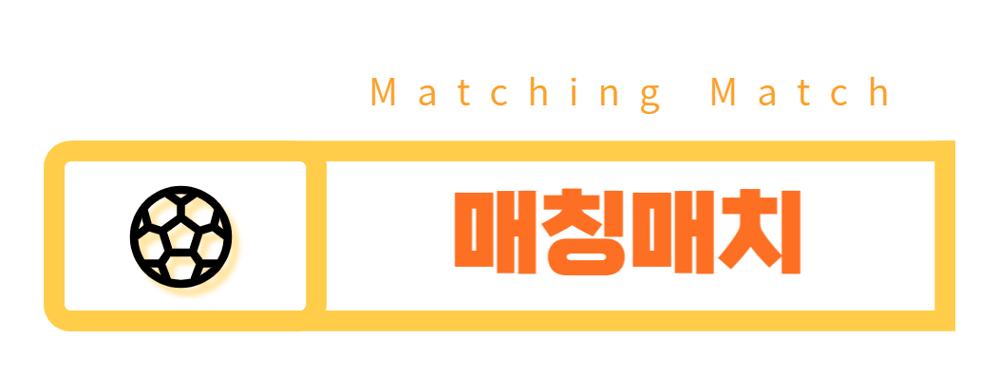

# 매칭매치 MatchingMatch

<div align="center">

</div>

안녕하세요. 웹개발 연합동아리 피로그래밍 18기 '매칭매치'입니다.

매칭매치는 축구 경기의 매칭을 도와주는 웹서비스입니다.

## 배포 주소

> https://www.matchingmatch.site

## 멤버 소개

- 송현지 : 프론트엔드, 팀장
- 최유진 : 프론트엔드
- 김혁수 : 풀스택
- 김태영 : 백엔드
- 김환준 : 백엔드

## 프로젝트 소개

> **축구 경기의 매칭을 도와주는 웹서비스** <br/> **개발기간: 2023.01 ~ 2023.02**

'매칭매치'는 축구 경기의 매칭을 도와주는 웹서비스입니다. 날짜, 지역, 성별, 마감여부 등으로 필터링을 통해 원하는 매치를 생성하거나 조회할 수 있습니다. 경기가 완료된 후 상태팀을 평가할 수 있으며, 이는 추후에 매너점수와 실력점수 평가에 반영됩니다.

## 설치 방법

### Requirements

For building and running the application you need:

- Python 3.11.1
- Django 4.2.7

### Installation

1. 레포지토리 클론

```bash
$ git clone https://github.com/matchingMatch/matchingMatch.git
$ cd server
```

2. 가상 환경 생성

```bash
$ python -m venv venv
$ source venv/bin/activate // Mac
$ venv\Scripts/activate    // Windows
```

3. 필요한 패키지 설치

```bash
$ pip install -r requirements.txt
```

4. 데이터베이스 마이그레이션

```bash
$ python manage.py makemigrations
$ python manage.py migrate
```

5. 서버 실행

```bash
$ python manage.py runserver
```

## 기술 스택

### Environment


### Config


### Development


### Communication


---

## 주요 페이지

|                                                         메인 페이지                                                          |                                                        팀목록 페이지                                                         |
| :--------------------------------------------------------------------------------------------------------------------------: | :--------------------------------------------------------------------------------------------------------------------------: |
|  |  |
|                                                       공지사항 페이지                                                        |                                                      신고게시판 페이지                                                       |
|  |  |

---

## 주요 기능

### ⭐️ 메인 페이지

- 매치 등록(리캡챠 도입)
- 매치 필터링 조회(날짜, 지역, 성별, 마감여부)
- 로그인/회원가입
- 경기 종료 후 상대팀 평가 알림창이 표시됨

### ⭐️ 매치 상세페이지

- 팀명, 경기장, 시간 조회
- 지도를 통한 위치 조회
- 작성자는 신청자 목록 조회 및 선정 가능
- 신청자는 매치 신청 가능

### ⭐️ 팀목록 페이지

- 팀 조회
- 팀 검색

### ⭐️ 공지사항 페이지

- 공지사항 조회
- 관리자는 공지사항 글 작성 가능

### ⭐️ 신고게시판 페이지

- 애로사항, 신고사항 글 조회 및 작성

---
